# Práctica 1 - Spring Boot: Instalación, Configuración Inicial y Primer Endpoint

---

## Configuración del proyecto

| Campo | Valor |
|---|---|
| Build Tool | Gradle – Kotlin DSL |
| Language | Java |
| Spring Boot | 4.1.0 |
| Packaging | Jar |
| Java | 17 |
| Group | ec.edu.ups.icc |
| Artifact | fundamentos01 |
| Package | ec.edu.ups.icc.fundamentos01 |

## Dependencias
- Spring Web
- Spring Boot DevTools

---

## Evidencias 

### 1. Verificación de Java
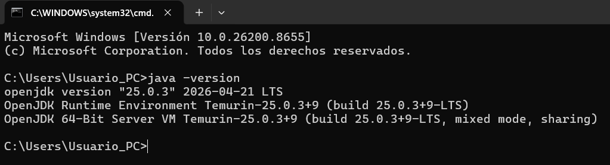

### 2. Servidor Spring Boot ejecutándose
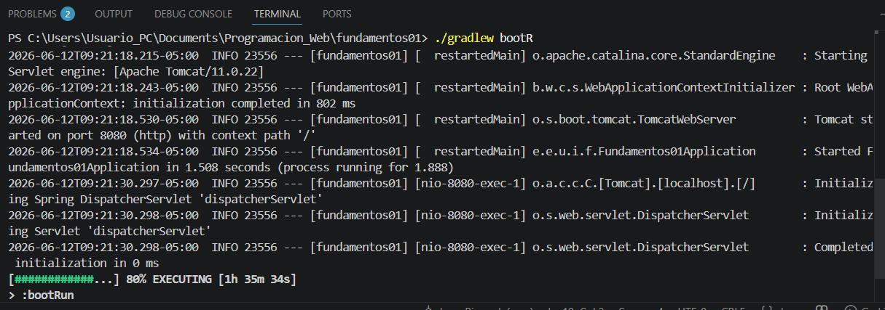

### 3. Endpoint /api/status funcionando
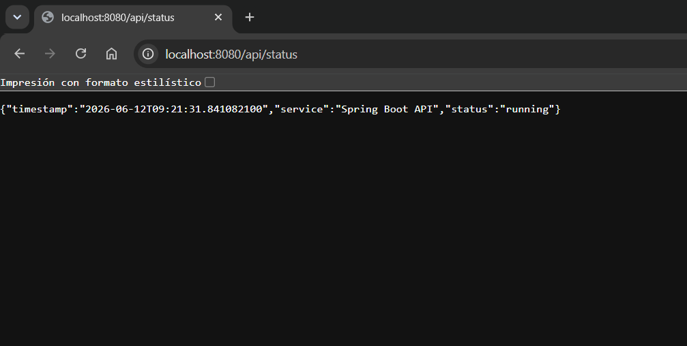

### 4. Archivo StatusController.java
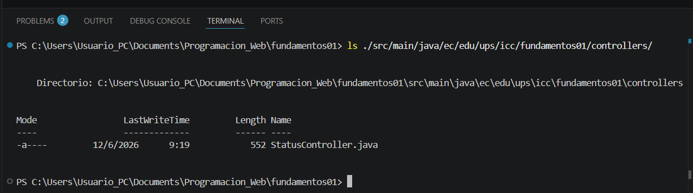

---

## Explicación

### Funcionamiento del endpoint
El endpoint `/api/status` cuando lo abres en el navegador te devuelve 
un JSON con el nombre del servicio, si está corriendo y la hora exacta. 
Lo que entendí es que `@RestController` es lo que hace que el método 
devuelva ese JSON automáticamente.

### Spring Boot y el servidor
No hay que instalar ningún servidor por separado, 
Spring Boot ya trae Tomcat incluido y lo inicia solo cuando se ejecuta
`./gradlew bootRun`. Con agregar la dependencia web ya 
funciona todo en el puerto 8080.

---

# Práctica 2 - Spring Boot: Estructura del Proyecto y Arquitectura Modular

## Estructura modular del proyecto

```
src/main/java/ec/edu/ups/icc/fundamentos01/
    ├── auth/
    ├── config/
    ├── core/
    │    ├── dtos/
    │    └── entities/
    ├── products/
    │    ├── controllers/
    │    ├── dtos/
    │    ├── entities/
    │    ├── mappers/
    │    ├── models/
    │    ├── repositories/
    │    └── services/
    ├── students/
    │    ├── controllers/
    │    └── models/
    ├── users/
    │    ├── controllers/
    │    ├── dtos/
    │    ├── entities/
    │    ├── mappers/
    │    ├── models/
    │    ├── repositories/
    │    └── services/
    ├── utils/
    └── Fundamentos01Application.java
```

## Evidencias

### 1. Estructura modular en el IDE
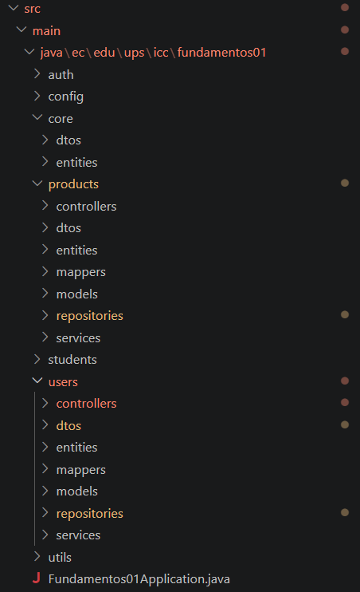

### 2. Archivo Fundamentos01Application.java
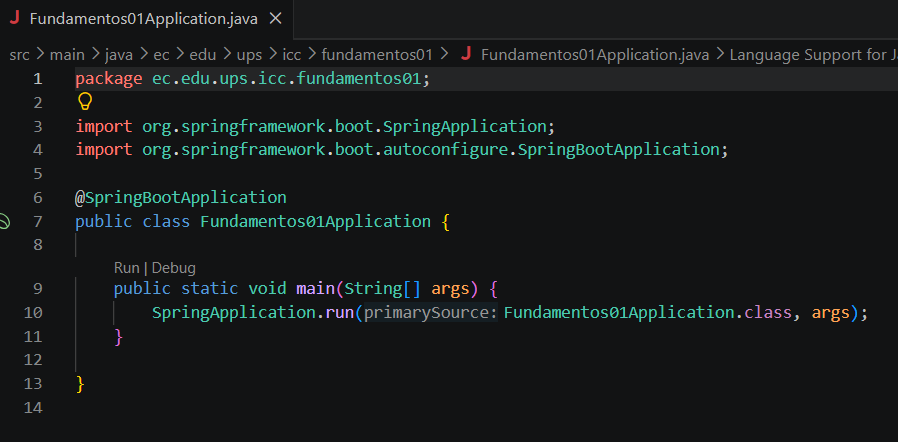

---

## Explicación: ¿Por qué usar módulos separados?

Separar el proyecto por dominios (products, users, auth) permite que
cada funcionalidad sea independiente: sus controladores, servicios,
repositorios y entidades están agrupados juntos. Esto facilita encontrar
y modificar código sin afectar otras partes del sistema. Además,
Spring Boot detecta todos los componentes automáticamente gracias al
@ComponentScan que activa @SpringBootApplication, siempre que estén
dentro del package raíz ec.edu.ups.icc.fundamentos01.

---

# Práctica 3 - Spring Boot: API REST con Controladores, DTOs, Modelos y Mappers

## Evidencias

### 1. GET /api/products - Lista de productos
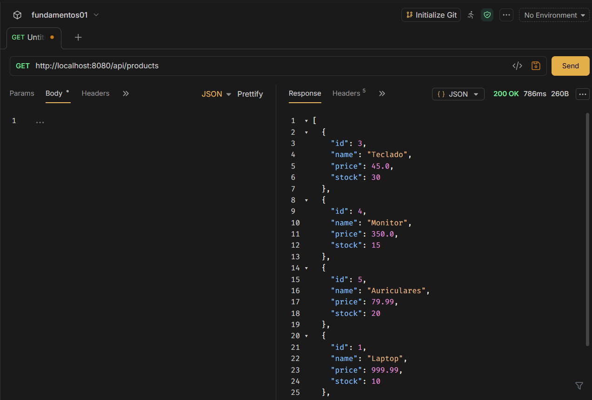

### 2. GET /api/products/1 - Producto por ID
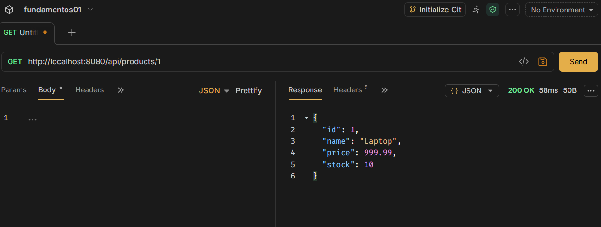

### 3. DELETE /api/products/1 - Eliminar producto existente
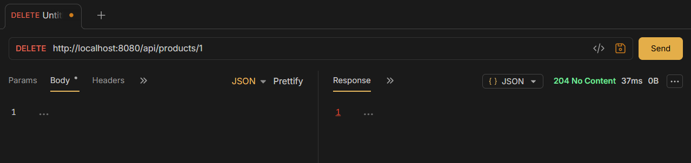

### 4. DELETE /api/products/99 - Eliminar producto inexistente
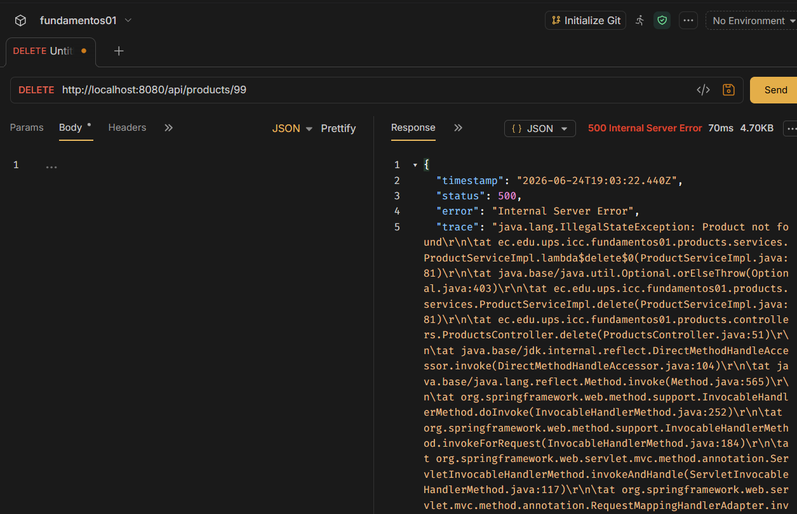

---

## Explicación

Se construyó un CRUD REST completo para el recurso products usando
controladores, DTOs, modelos y mappers. El DTO de entrada recibe solo
name, price y stock, mientras que el DTO de respuesta devuelve esos
mismos campos más el id generado automáticamente. El mapper convierte
entre DTO, modelo y entidad sin exponer datos internos. Los endpoints
siguen el estándar REST: GET retorna 200, DELETE retorna 204 No Content
cuando el producto existe, y 500 con mensaje "Product not found" cuando
no existe.

---

# Práctica 4 - Spring Boot: Controladores + Servicios + Lógica de Negocio

## Evidencias

### 1. ProductServiceImpl.java
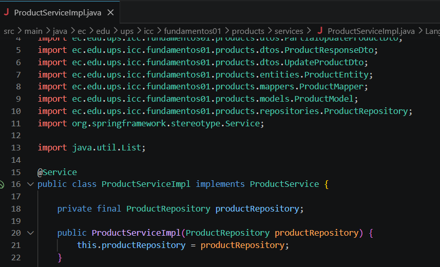

### 2. ProductsController.java
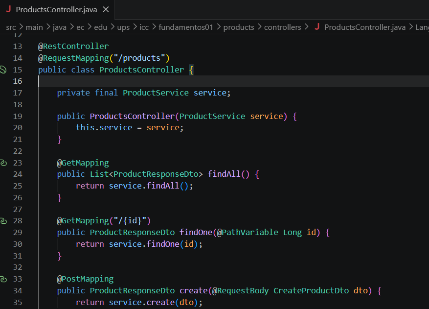

---

## Explicación: ¿Cómo se inyecta el servicio en el controlador?

El controlador no crea manualmente el servicio. En su lugar declara
una dependencia final y la recibe por constructor:

    private final ProductService service;

    public ProductsController(ProductService service) {
        this.service = service;
    }

Spring Boot detecta que el controlador necesita un ProductService,
busca una clase que implemente esa interfaz, encuentra ProductServiceImpl
porque tiene la anotación @Service, crea una instancia automáticamente
y la inyecta en el controlador. Esto se llama inyección de dependencias
por constructor y permite que el controlador no tenga lógica de negocio,
solo delega cada operación al servicio.

---

# Práctica 5 - Spring Boot: Persistencia con JPA, Entidades y Repositorios

## Evidencias

### 1. Productos en PostgreSQL
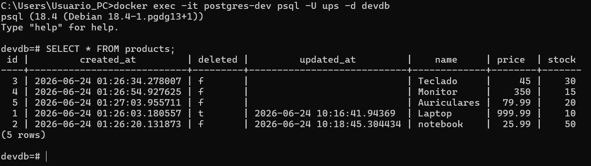

---

## Explicación: Flujo de datos desde la API REST hasta PostgreSQL

Cuando llega una petición HTTP al controlador, este delega al servicio.
El servicio convierte el DTO de entrada en un ProductModel usando el
mapper. Luego convierte el modelo en una ProductEntity y la guarda en
PostgreSQL mediante el ProductRepository. Al leer datos, el repositorio
devuelve entidades que el mapper convierte a modelos y luego a DTOs de
respuesta que se envían al cliente.

BaseEntity centraliza los campos comunes de todas las entidades: id
generado automáticamente por PostgreSQL, createdAt asignado con
@PrePersist, updatedAt actualizado con @PreUpdate, y deleted para
eliminación lógica. Esto evita repetir esos campos en cada entidad.

---

# Práctica 6 - Spring Boot: Validación de DTOs y Control de Datos de Entrada

## Evidencias

### 1. POST inválido → 400 Bad Request
Se envió `name` vacío, `price` negativo y `stock` negativo. Spring Boot rechaza la petición antes de llegar al servicio.

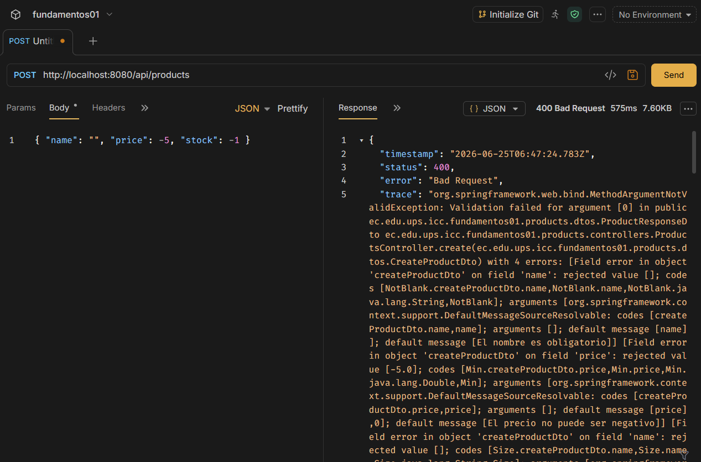

### 2. POST válido → producto creado correctamente
Se creó el producto "Camara" con precio y stock válidos.

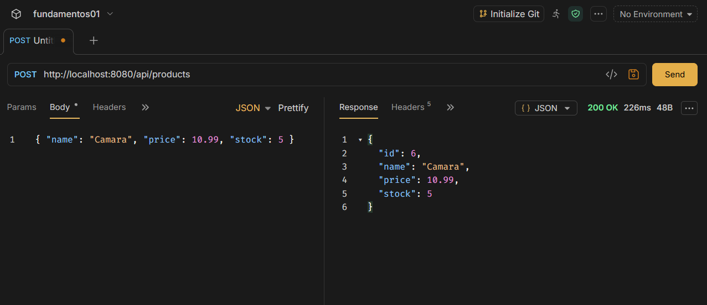

### 3. PUT sobre producto eliminado → error
Se eliminó el producto con id 6 y luego se intentó actualizarlo. El servicio lanza `"Cannot update a deleted product"`.

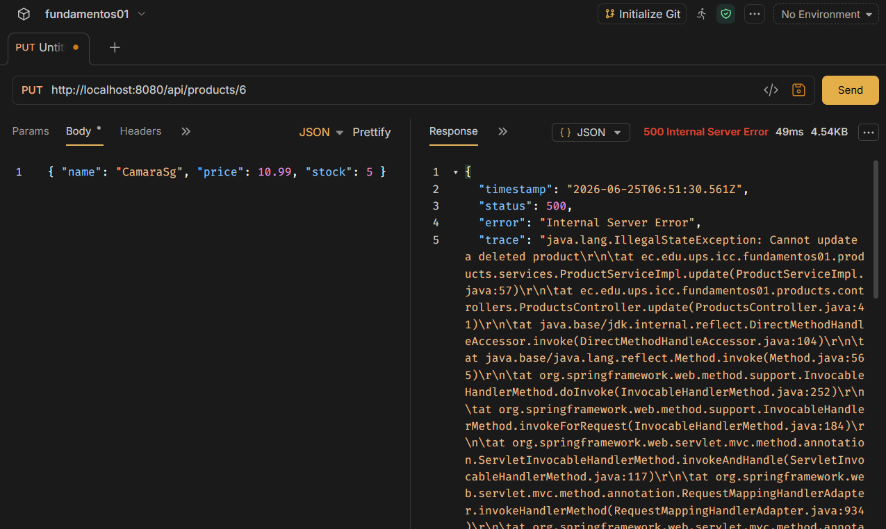

### 4. GET findAll → producto eliminado no aparece
Después de eliminar el producto con id 6, el listado solo devuelve los productos activos. El id 6 no aparece en la respuesta.

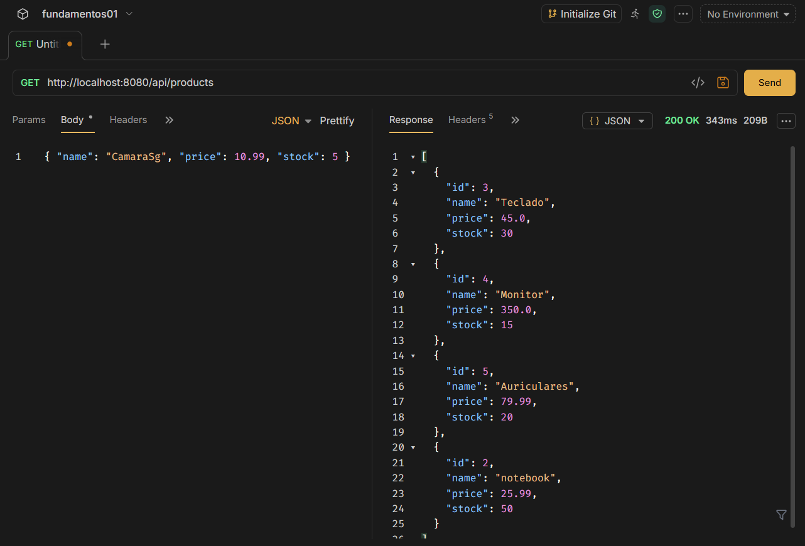

---

# Práctica 7 - Spring Boot: Manejo Global de Errores y Excepciones

## Evidencias

### 1. GET producto inexistente → 404 Not Found
Se buscó un producto con id 999 que no existe. El handler devuelve el formato estándar de error.

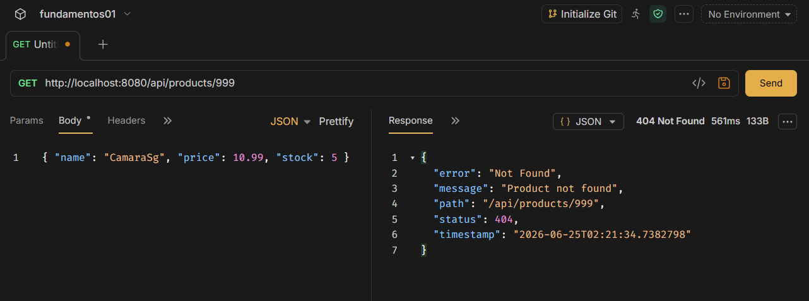

### 2. POST producto duplicado → 409 Conflict
Se intentó crear un producto con el nombre "Teclado" que ya existe en la base de datos.

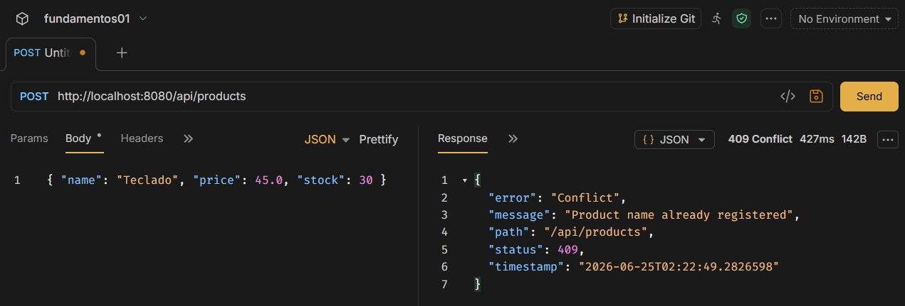

### 3. POST inválido → 400 Bad Request con details
Se enviaron datos inválidos. El handler devuelve el campo `details` con el error específico de cada campo.

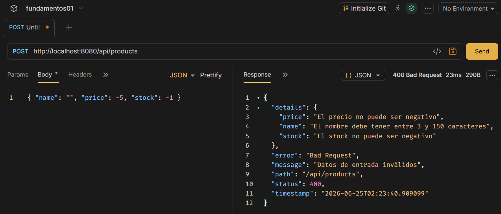

---

# Práctica 8 - Spring Boot: Relaciones ManyToOne, Foreign Keys y Consultas Relacionales

## Relaciones implementadas

En esta práctica los productos dejaron de existir de forma aislada. Ahora cada producto se relaciona con:

- Un **usuario** (`UserEntity`) que lo registra
- Una **categoría** (`CategoryEntity`) a la que pertenece

Ambas relaciones son `@ManyToOne` desde `ProductEntity`:

```java
@ManyToOne(optional = false, fetch = FetchType.LAZY)
@JoinColumn(name = "user_id", nullable = false)
private UserEntity owner;

@ManyToOne(optional = false, fetch = FetchType.LAZY)
@JoinColumn(name = "category_id", nullable = false)
private CategoryEntity category;
```

Esto crea dos columnas de clave foránea en la tabla `products`: `user_id` y `category_id`, ambas `NOT NULL` porque un producto no puede existir sin usuario ni categoría (`optional = false`).

## Nuevo módulo: categories

Se agregó el módulo `categories/` completo (entidad, DTOs, repositorio, servicio y controlador), siguiendo el mismo patrón de capas que ya usaba `products/`.

## Evidencias

### 1. Estructura de la tabla `products` en PostgreSQL
Se verificó con `\d products` que las columnas `user_id` y `category_id` se crearon como claves foráneas hacia `users` y `categories`.

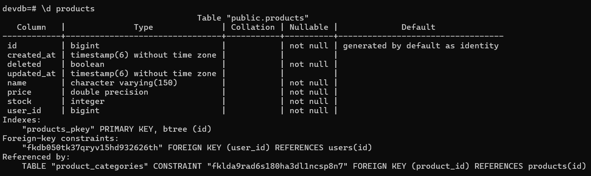

### 2. Creación de producto con relaciones anidadas
Al crear un producto enviando `userId` y `categoryId`, la respuesta devuelve los objetos `owner` y `category` completos, no solo sus IDs.

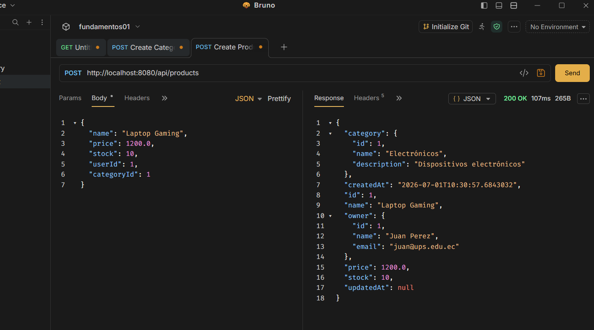

### 3. Consulta de productos por categoría
`GET /api/products/category/{categoryId}` devuelve solo los productos activos de esa categoría.

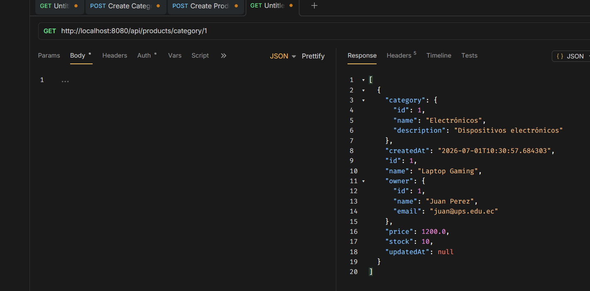

---

## Explicación: ¿Cómo se relaciona ProductEntity con UserEntity y CategoryEntity?

Se uso `@ManyToOne` porque la relación es "muchos productos pertenecen a un mismo usuario/categoría" — es la entidad "muchos" (`Product`) la que apunta hacia la entidad "uno" (`User` o `Category`). `@JoinColumn` define el nombre exacto de la columna de clave foránea que Hibernate crea en la tabla `products` (`user_id` y `category_id`), apuntando al `id` de la tabla relacionada.

Se uso `fetch = FetchType.LAZY` en vez de `EAGER` porque así el usuario y la categoría solo se cargan de la base de datos cuando realmente se accede a ellos (`entity.getOwner()`), en vez de traerlos siempre aunque no se necesiten. Esto es importante en listados grandes, donde cargar todas las relaciones de golpe sería un desperdicio de consultas.

Antes de guardar un producto, el servicio valida que tanto el usuario como la categoría existan y no estén eliminados lógicamente (`deleted = false`); si alguno no existe, se lanza `NotFoundException` y la API responde `404 Not Found`.

---

# Práctica 9 - Spring Boot: Request Parameters, Consultas Relacionadas y Filtrado con JPA

## Cambios en esta práctica

Se cambio las rutas técnicas (`/products/user/{userId}`, `/products/category/{categoryId}`) por rutas semánticas:

GET /api/users/{id}/products
GET /api/categories/{id}/products

Ambas aceptan filtros opcionales por query params: `name`, `minPrice`, `maxPrice`, y según el contexto, `categoryId` o `userId`.

También cambié la relación entre productos y categorías de `@ManyToOne` (una sola categoría por producto) a `@ManyToMany`, usando una tabla intermedia `product_categories`. Ahora los DTOs reciben `categoryIds` (un Set) en vez de `categoryId`.

## Evidencias

### 1. Producto creado con varias categorías
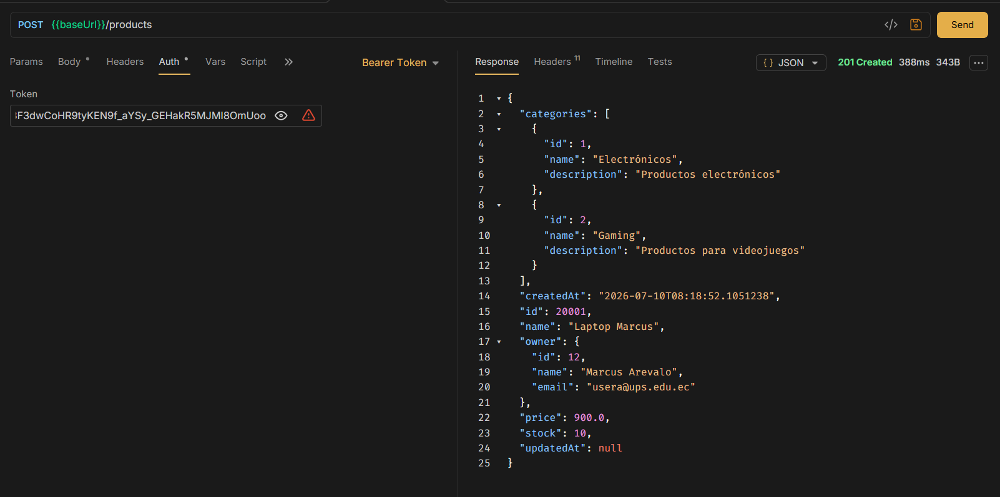

### 2. Filtro de productos por usuario
`GET /api/users/12/products?name=laptop&minPrice=500`

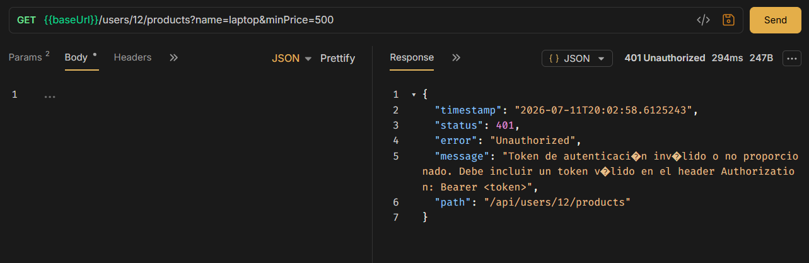

### 3. Filtro de productos por categoría
`GET /api/categories/1/products?userId=12`

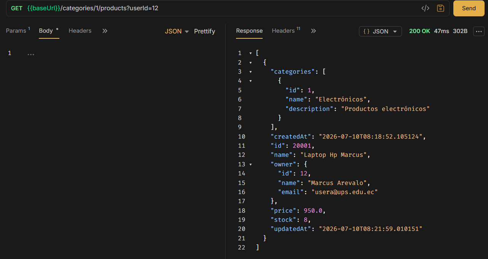

---

## Explicación

El endpoint está en `/users/{id}/products` pero uso `ProductService` y `ProductRepository`, no un servicio de usuarios, porque lo que realmente se consulta es el recurso `products`. La URL solo define el contexto (desde dónde se pide), pero la lógica de negocio de productos sigue viviendo en un solo lugar.

Al pasar de una sola categoría a varias, la columna `category_id` en `products` desapareció y se creó la tabla intermedia `product_categories`. Las consultas del repositorio pasaron de comparar `p.category.id` a hacer un `JOIN p.categories c`, y tuve que usar `DISTINCT` porque un producto con varias categorías puede aparecer repetido en el resultado del JOIN.

---

# Práctica 10 - Spring Boot: Paginación de Productos con Page, Slice y Pageable

Paginación a los endpoints de productos usando `Page` y `Slice` de Spring Data JPA, para no devolver todos los registros de una sola vez. Se mantiene `GET /products` sin paginar, y se agregaron `GET /products/page` y `GET /products/slice`. 

## Evidencias

### 1. Respuesta con Page
`GET /products/page?page=0&size=5&sortBy=price&direction=desc` — incluye `totalElements`, `totalPages`, `number`, `size`, `first`, `last`.


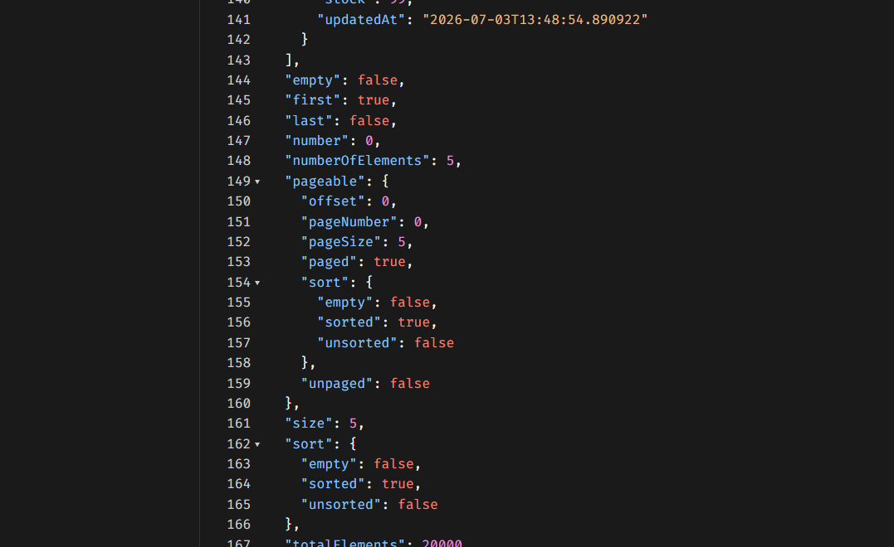

### 2. Respuesta con Slice
`GET /products/slice?page=0&size=5&sortBy=createdAt&direction=desc` — no incluye `totalElements` ni `totalPages`.

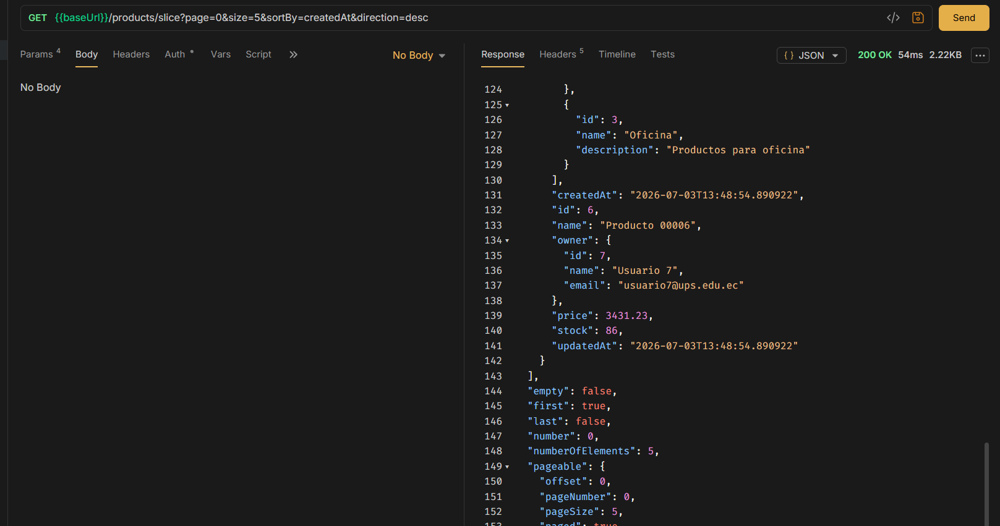

### 3. Error por paginación inválida
`GET /products/page?page=-1&size=0` → 400 Bad Request con el formato estándar de `ErrorResponse`.

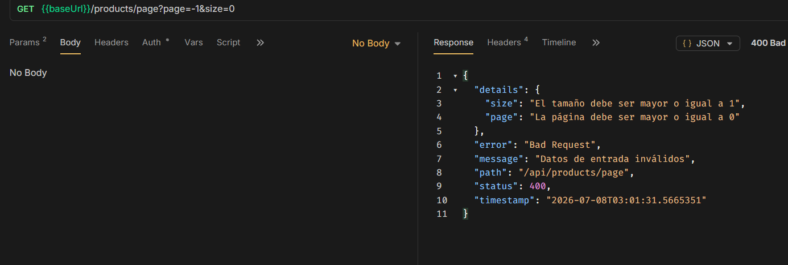

### 4. Endpoint de categoría paginado con Page
`GET /categories/2/products/page?page=0&size=5` — productos filtrados por categoría con metadatos de Page.

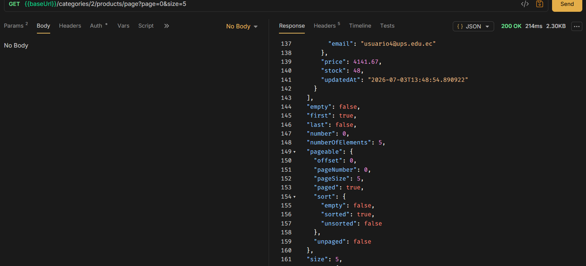

### 5. Endpoint de categoría paginado con Slice
`GET /categories/2/products/slice?page=0&size=5` — productos filtrados por categoría con metadatos de Slice.

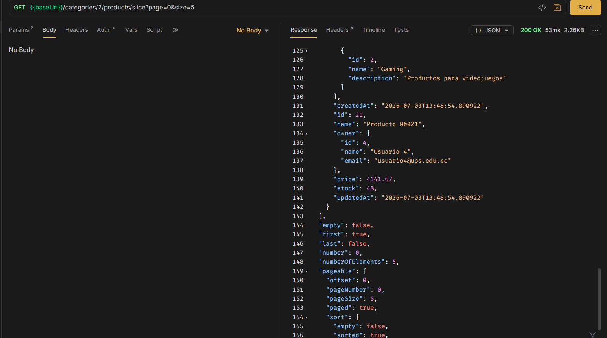

---

## Explicación

`Page` trae los datos más el total de elementos y total de páginas, porque ejecuta una consulta extra de COUNT. `Slice` no hace ese COUNT, solo trae los datos y sabe si hay una página siguiente o no, por eso es más rápido pero no sirve si necesito mostrar "página 1 de 20" en el frontend.

La paginación tiene que aplicarse en el repositorio (con `LIMIT`/`OFFSET` en el `Pageable`) y no traer todo a memoria y cortar ahí, porque si tengo 20,000 productos y solo pido 5, traer los 20,000 desde la base de datos para luego quedarme con 5 es un desperdicio enorme de memoria y tiempo. Con `Pageable` en la consulta, la base de datos solo devuelve los 5 registros que realmente necesito.

---

# Práctica 11 - Spring Boot: Autenticación JWT, Autorización por Roles y Protección de Endpoints

Los endpoints estaban abiertos, cualquiera podía crear, editar o borrar lo que sea sin identificarse. Agregué autenticación con JWT (JSON Web Token): el usuario se registra o hace login en `/auth/register` y `/auth/login`, recibe un token, y lo manda en el header `Authorization: Bearer <token>` en cada petición a un endpoint protegido.

Creé un paquete `security/` nuevo con toda la lógica: `RoleEntity`/`RoleName` (tabla separada de roles, relación ManyToMany con `UserEntity`), `JwtUtil` (genera y valida el token), `UserDetailsImpl`/`UserDetailsServiceImpl` (conectan mi `UserEntity` con Spring Security), los filtros `JwtAuthenticationFilter` (revisa el token en cada request) y `JwtAuthenticationEntryPoint` (responde 401 en formato JSON cuando falta o es inválido el token), y `SecurityConfig` (define qué rutas son públicas y cuáles no, y conecta todo).

Las contraseñas se guardan con BCrypt, nunca en texto plano. Todo usuario nuevo se registra con `ROLE_USER` por defecto (esos roles base los crea `SecurityDataInitializer` al arrancar la app).

## Evidencias

### 1. Registro exitoso
`POST /auth/register` → 201 Created, con token generado y `ROLE_USER` asignado.

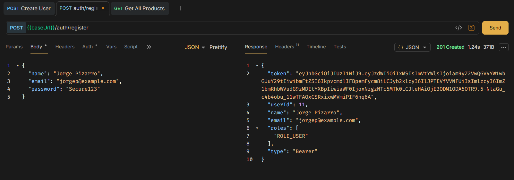

### 2. Login exitoso
`POST /auth/login` → 200 OK, con token y roles del usuario.

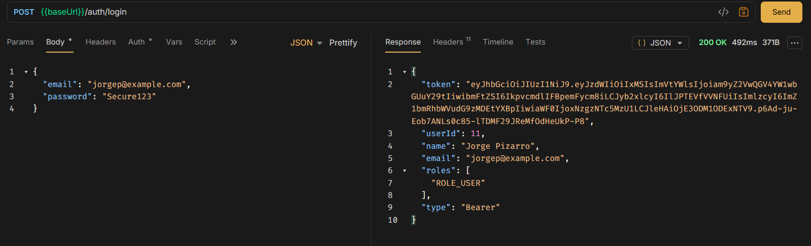

### 3. Endpoint protegido sin token
`GET /products/page` sin header Authorization → 401 Unauthorized.

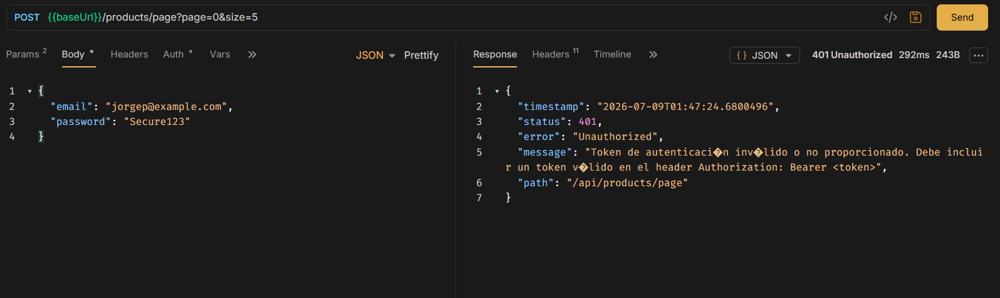

### 4. Endpoint protegido con token
El mismo endpoint, ahora con `Authorization: Bearer <token>` → 200 OK.

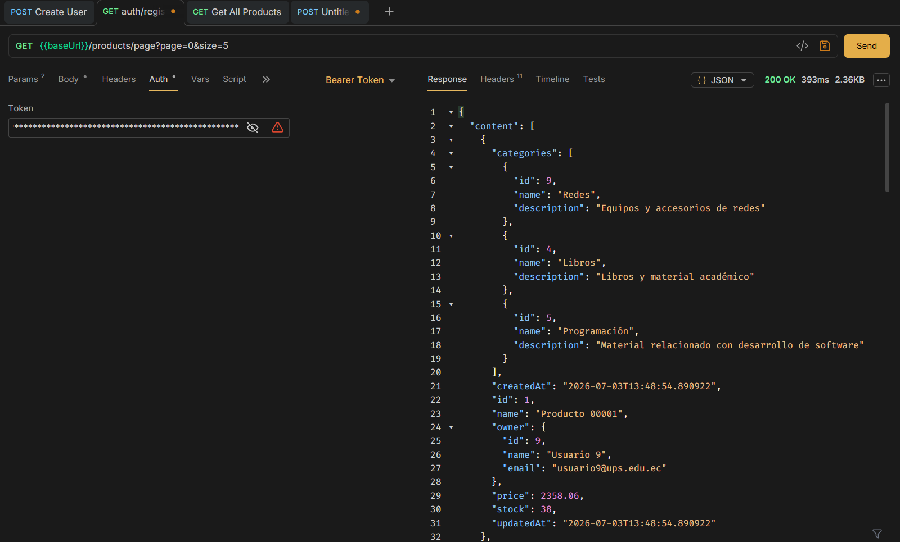

---

# Práctica 12 - Spring Boot: Protección de Endpoints con Roles

Con JWT ya funcionando, cualquier usuario autenticado (con cualquier rol) podía acceder a todos los endpoints igual. Agregué `@PreAuthorize("hasRole('ADMIN')")` al endpoint `GET /products` (el que lista todo sin paginar), para que solo un usuario con `ROLE_ADMIN` pueda usarlo.

También tuve que agregar manejadores nuevos en `GlobalExceptionHandler` para `AuthorizationDeniedException` y `AccessDeniedException`, porque sin ellos Spring Security devolvía 500 en vez de 403 cuando a alguien le faltaba el rol.

## Evidencias

### 1. ADMIN accede correctamente
Jorge (con `ROLE_ADMIN`) consulta `GET /products` y recibe la lista completa.

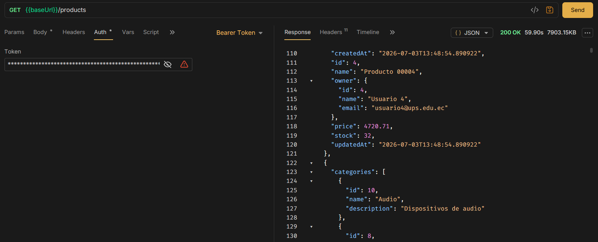

### 2. Usuario sin ADMIN es bloqueado
Daniela (solo `ROLE_USER`) intenta lo mismo y recibe 403 Forbidden, no 500.

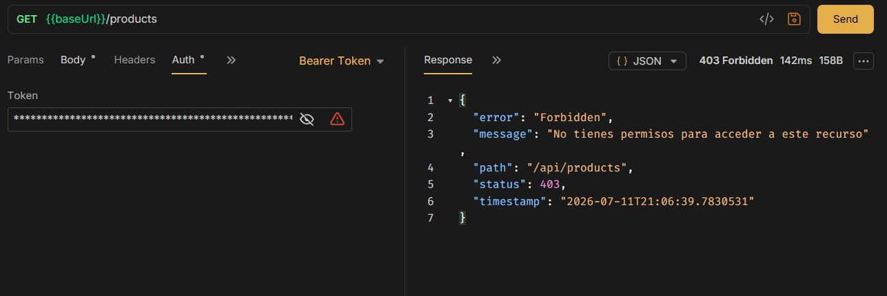

---

# Práctica 13 - Spring Boot: Validación de Propiedad de Recursos (Ownership)

Con roles ya funcionando, faltaba resolver algo: cualquier usuario autenticado podía editar o borrar productos de otros usuarios, no solo los suyos. Agregué validación de ownership en el servicio: `validateOwnership()` revisa si el usuario actual es el dueño del producto o tiene `ROLE_ADMIN`; si no es ninguna de las dos, lanza `AccessDeniedException` y responde 403.

Se quito el campo `userId` de `CreateProductDto`. Antes cualquiera podía mandar el `userId` que quisiera en el body y crear productos a nombre de otro usuario. Ahora el owner sale directo del token (`@AuthenticationPrincipal UserDetailsImpl currentUser`), no del body.

## Evidencias

### 1. Creación de producto con owner desde el token
Al crear un producto no se manda `userId`; el `owner` en la respuesta corresponde al usuario autenticado.


### 2. Usuario actualiza su propio producto
Marcus edita su producto y recibe 200 OK.

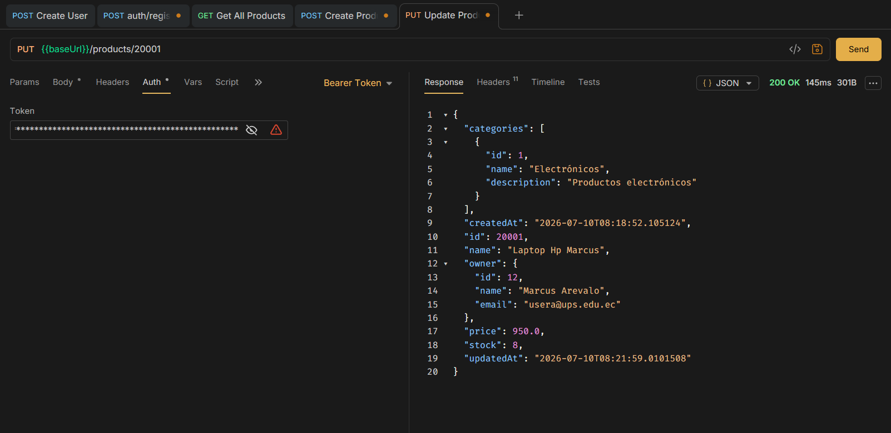

### 3. Usuario intenta modificar producto ajeno
Daniela intenta editar el producto de Marcus → 403 Forbidden.

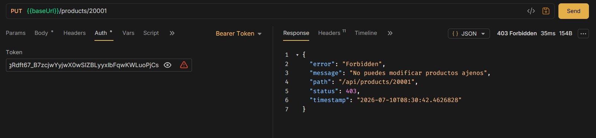

### 4. Usuario intenta eliminar producto ajeno
Daniela intenta eliminar el producto de Marcus → 403 Forbidden.

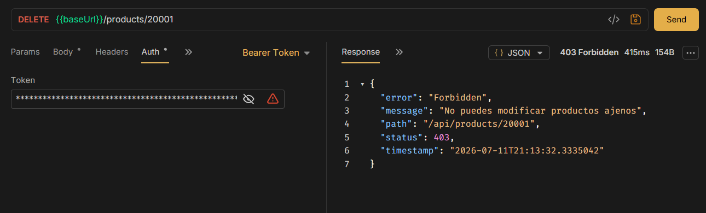

### 5. ADMIN modifica producto ajeno
Jorge (ROLE_ADMIN) edita el producto de Marcus sin ser el dueño → 200 OK. El `owner` no cambia, sigue siendo Marcus.


---

## Explicación

**¿Qué es ownership?** Que un recurso (en este caso, un producto) le pertenece a un usuario específico, y solo ese usuario (o alguien con permisos especiales, como ADMIN) puede modificarlo o eliminarlo.

**¿Por qué no es seguro recibir `userId` en `CreateProductDto`?** Porque si el cliente puede mandar cualquier `userId` en el body, un usuario autenticado podría crear productos a nombre de otro usuario con solo cambiar ese número, sin que el sistema pueda verificar que realmente es quien dice ser. Por eso el owner tiene que salir del token, que ya fue validado por el filtro de JWT.

**¿Diferencia entre autorización por rol y por ownership?** Por rol es una regla fija: "solo ADMIN puede entrar acá", sin importar de quién es el recurso. Por ownership depende del dato concreto: "puedes editar este producto si es tuyo", y se calcula comparando el `owner` del recurso con el usuario autenticado en cada petición, no de antemano.

# Práctica 14 - Renovación de Access Token con Refresh Token

## Evidencias

### 1. Login con refresh token
`POST /api/auth/login` → `200 OK`, respuesta incluye `token`, `refreshToken` y `roles`.

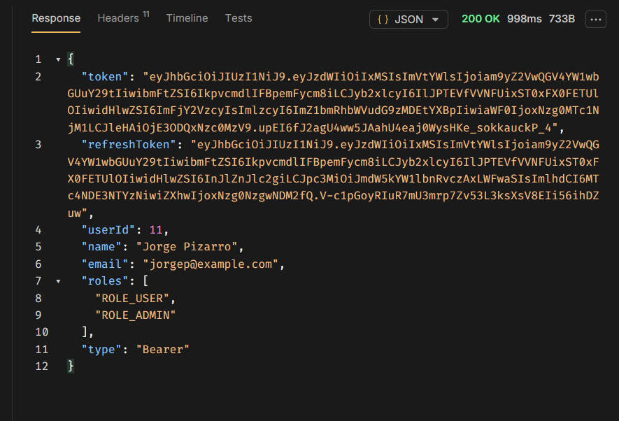

### 2. Refresh exitoso
`POST /api/auth/refresh` con el `refreshToken` del login → `200 OK`, nuevo `token` y nuevo `refreshToken`.

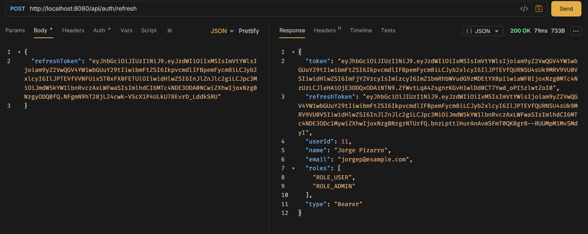

### 3. Logout
`POST /api/auth/logout` con el `refreshToken` vigente → `204 No Content`.

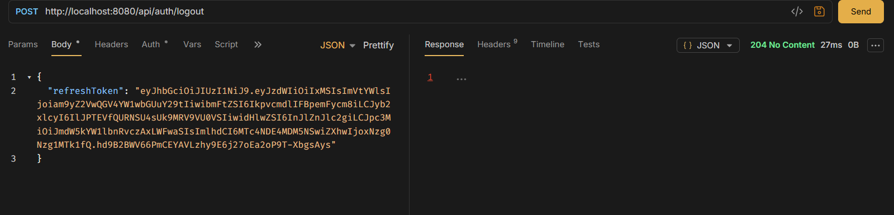

### 4. Refresh después de logout
`POST /api/auth/refresh` con el mismo `refreshToken` ya revocado por el logout → `400 Bad Request`, `"Refresh token no encontrado o revocado"`.

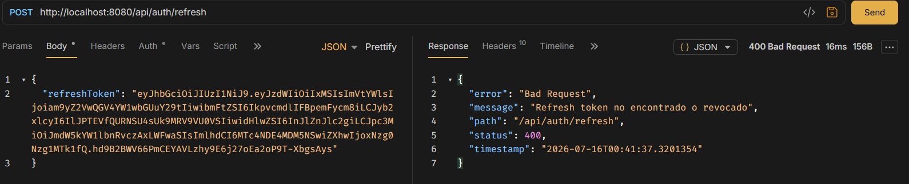

## Explicación

**¿Cuál es la diferencia entre access token y refresh token?** El access token se usa en cada petición a un endpoint protegido (`Authorization: Bearer <token>`) y dura poco (30 minutos). El refresh token solo se usa para pedir un access token nuevo (`POST /auth/refresh`), dura mucho más (7 días), y no sirve para consumir endpoints protegidos.

**¿Por qué el refresh token no debe usarse en `Authorization: Bearer`?** Porque cada token lleva un claim `type` (`access` o `refresh`), y `JwtAuthenticationFilter` valida específicamente con `validateAccessToken()`. Si se intenta usar un refresh token como access token, el filtro lo rechaza con `401`, aunque la firma del JWT sea válida — la validez criptográfica no es suficiente, también debe ser del tipo correcto.

**¿Qué significa rotar un refresh token?** Que cada vez que se usa un refresh token para renovar la sesión, ese token se revoca de inmediato y se genera uno nuevo. Así ningún refresh token puede reutilizarse más de una vez — si alguien lo reutiliza (por ejemplo, un token robado), la API lo rechaza porque ya está marcado como `revoked = true` en base de datos.

# Práctica 16 - Despliegue portable de Spring Boot con Docker y Nginx en Ubuntu Server

## Entregables Evidencias

### 1. Ambos contenedores en ejecución
`docker ps` en Ubuntu Server mostrando `fundamentos-api` (healthy) y `fundamentos-nginx` corriendo.

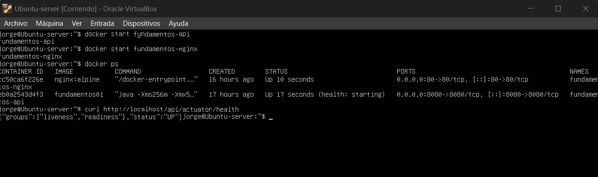

### 2. Health check desde Ubuntu Server
`curl http://localhost/api/actuator/health` dentro de la VM, a través de Nginx.


### 3. Health check desde la máquina anfitriona
`Invoke-RestMethod http://192.168.56.2/api/actuator/health` desde Windows.

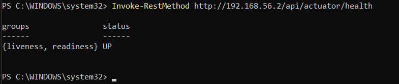

### 4. Conexión a PostgreSQL externo
PostgreSQL corre como contenedor Docker en la máquina host (Windows). El contenedor `fundamentos-api`, en la VM, se conecta a `192.168.56.1:5432` a través de la red Host-Only de VirtualBox. Evidencia: log del contenedor mostrando `Started Fundamentos01Application` tras conectar exitosamente.

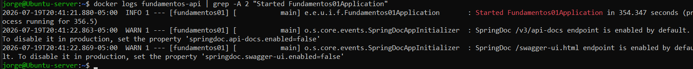

### 5. Login desde la máquina anfitriona con Bruno
`POST http://192.168.56.2/api/auth/login` desde Bruno (Windows) → `200 OK` con `token` y `refreshToken`.

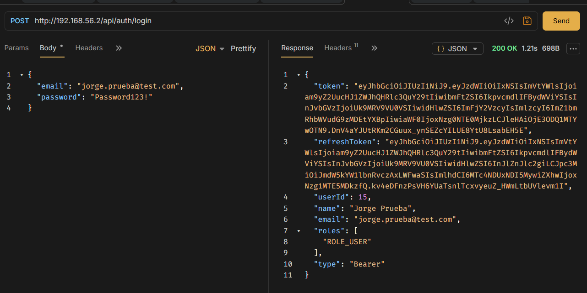

### 6. Swagger UI accesible vía Nginx desde el navegador
`http://192.168.56.2/api/swagger-ui/index.html` cargando desde un navegador en Windows, confirmando que toda la documentación interactiva de la API también es accesible a través del reverse proxy.

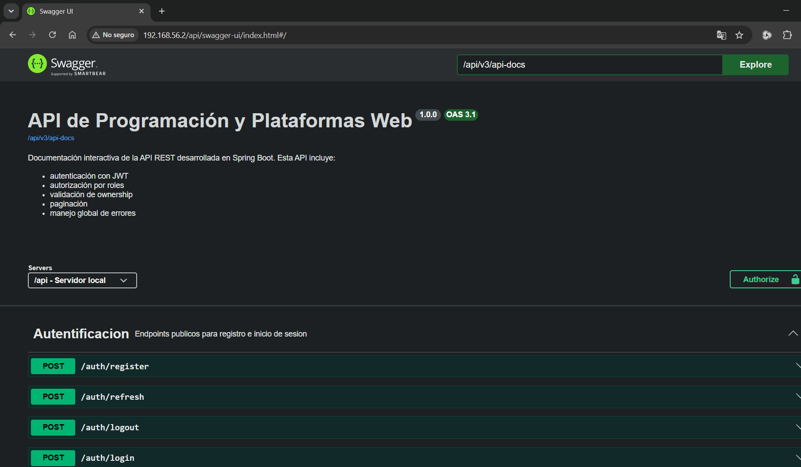